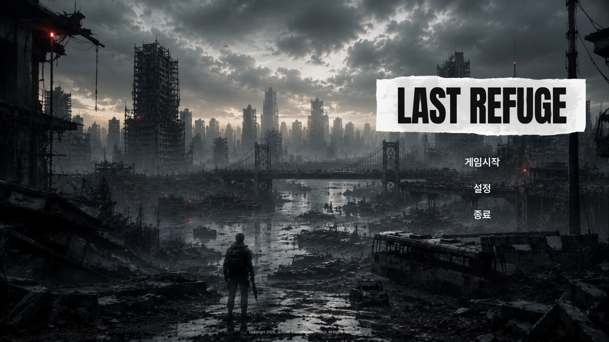
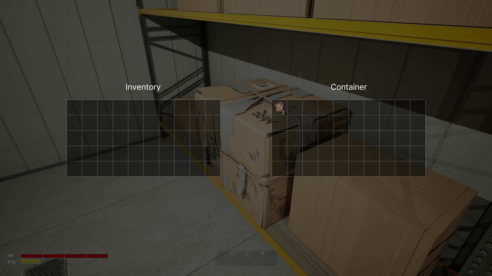
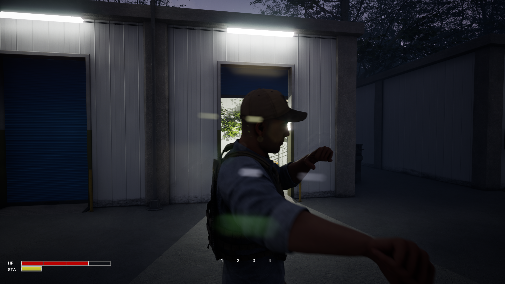
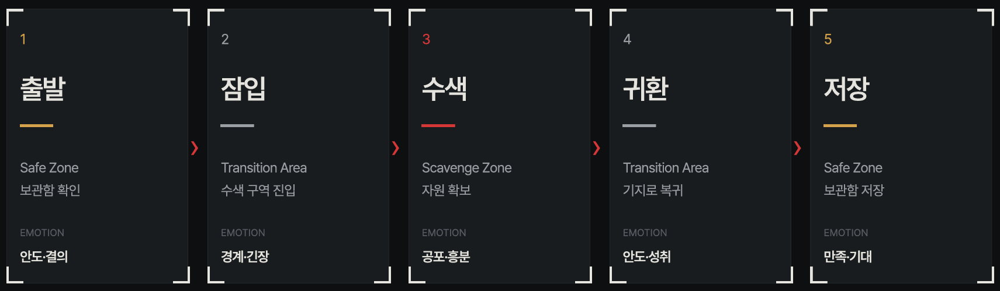

# Last Refuge
 

[LastRefuge Website](https://jjinzxx.github.io/LastRefuge/)
  

> 포스트 아포칼립스 하드코어 잠입 생존 게임 — Unreal Engine 5 C++ 2주 스프린트 프로젝트

  

| 항목 | 내용 |
|------|------|
| 장르 | 포스트 아포칼립스 / 인스트랙션 슈팅 |
| 플랫폼 | PC (Windows) 싱글플레이 |
| 개발 기간 | 2026-05-11 ~ 2026-05-21 (11일) |
| 엔진 | Unreal Engine 5.7.4 |
| 언어 | C++ (JetBrains Rider) |
| 모듈 | `LastRefuge` / 접두사 `LR` |

  

## In-Game Preview
> 시연 영상 및 플레이 영상 및 이미지
<!-- YouTube -->

<!-- 메인메뉴 -->

<!-- 수색 -->

<!-- 전투 -->

**주요 플레이 장면 구성**

| 장면 | 설명 |
|------|------|
| 잠입 | AI 시야/청각 회피, 자세 전환(달리기/걷기/웅크리기) |
| 수색 | 컨테이너 접근 후 3초 게이지 채워 아이템 획득 |
| 인벤토리 | 10×5 그리드 드래그앤드롭 |
| 전투 | 근접 공격(LMB) + 뒤에서 제압(F키) |
| 귀환 | 보관함에 자원 저장 후 레벨 전환 |

  

## Game Overview & Loop
### 세계관 / 시놉시스
문명이 붕괴한 세계. 플레이어는 마지막 안전 기지를 거점으로 삼아, 폐허가 된 도시를 탐색하며 생존 자원을 확보해야 한다. 적대적인 생존자(봇)가 배회하는 위험 구역에서 들키지 않고 물자를 수집해 기지로 귀환하는 것이 핵심이다.

### 핵심 게임 루프

<!-- 게임루프 -->

**3가지 플레이 스타일**

- **잠입** : 웅크려 이동, 소음 반경 최소화 → AI 감지 회피
- **전투** : 근접 공격(30 데미지, 0.8초 쿨다운) + 제압(즉사)
- **혼합** : 후방 제압 후 나머지 AI 잠입 회피

  

## Key Systems & UI

### 캐릭터 / 적

| 대상 | 주요 특성 |
|------|-----------|
| 플레이어 (ALRCharacter) | 1인칭 카메라, 3단계 이동(웅크리기/걷기/달리기), HP 100 / STA 100, 근접 공격 + 제압 |
| AI 봇 (ALRBot) | 3-State FSM (순찰/의심/전투), 시야 1200 + 청각 1800 범위, HP 100, 근접 공격 25 데미지 |

### 핵심 시스템

**이동 & 소음 (ALRCharacter / ULRStatusComponent)**
- 자세별 이동 속도 : 웅크리기 100 / 걷기 250 / 달리기 400
- 자세별 소음 반경 : 웅크리기 100 / 걷기 400 / 달리기 1200
- 스테미나 소모(달리기) / 회복(정지), 소진 시 달리기 강제 중단
- 발자국 사운드 : `UAudioComponent` 루프 방식, 자세별 피치·볼륨 변조

**AI 시스템 (ALRBot / ALRBotAIController)**
- Behavior Tree + Blackboard 기반 FSM
- `UAISenseConfig_Sight` (시야각 45도) + `UAISenseConfig_Hearing` 병행
- 상태 전환 : Patrol → Suspicious(소음 감지) → Combat(시야/피격)
- 근접 공격 : 거리 150 이내 진입 시 애니메이션 몽타주 + 데미지

**수색 시스템 (ALRContainer)**
- 전방 LineTrace로 상호작용 대상 탐색
- E키 유지 → 3초 게이지 채우기, 중단 시 초기화
- 수색 중 `UAudioComponent` 루프음 재생, 완료/취소 시 단발음
- 컨테이너 등급 : Normal / Locked(키카드 잠금) / Alarmed(수색 완료 시 AI 경보 트리거)

**이동속도 무게 연동 (ALRCharacter / ULRInventoryGridComponent)**
- `GetTotalWeight()` : 인벤 전체 `Weight × Quantity` 합산
- `UpdateMovementSpeed()` : `Weight / MaxCarryWeight` 비율로 속도 배수 Lerp(1.0 → 0.5)
- `OnGridChanged` 델리게이트 바인딩 → 아이템 변경 시 자동 재계산

**여닫이문 (ALROpenableDoor)**
- `USceneComponent(HingeRoot)` 기반 경첩 회전 — 액터 원점 = 경첩 위치로 배치
- `OnConstruction`에서 메시 Y 오프셋 적용 → 에디터 실시간 확인
- `Tick FInterpTo` 부드러운 회전 애니메이션, 선택적 키카드 잠금 지원

**그리드 인벤토리 (ULRInventoryGridComponent)**
- 10×5 그리드, 아이템 크기별 다중 셀 점유
- 드래그앤드롭, 아이템 회전(R키), Shift+클릭 빠른 이동
- 우클릭 컨텍스트 메뉴 (사용하기 / 정보)
- 아이템 스태킹 (`Quantity` 필드)
- `NativePaint` 기반 라인아트 스타일 렌더링 (배치 가능 녹색 / 불가 적색)

**보관함 (ALRStorage / ULRStorageWidget)**
- 인벤토리(좌) + 창고(우) 분할 UI
- Shift+클릭으로 그리드 간 빠른 이동
- `ULRSaveGame`으로 디스크 직렬화, 레벨 전환/메인메뉴 복귀 시 자동 저장

**툴바 (ULRToolbarSlotWidget)**
- 1~4 슬롯, 인벤토리와 분리된 물리적 보관 공간
- 숫자키 1~4 즉시 사용, 그리드에서 드래그앤드롭으로 배치

**전투 (ALRCharacter / ALRBot)**

| 공격 | 방식 | 수치 |
|------|------|------|
| 플레이어 근접 공격 | LMB, ECC_Pawn LineTrace | 범위 250, 데미지 30, 쿨다운 0.8초 |
| 플레이어 제압 | F키, 후방 ±60도, 거리 150 | 즉사 + DeathMontage |
| 봇 근접 공격 | 거리 150 이내 자동 | 데미지 25, 인터벌 1.5초 |

### UI / UX

| 위젯 | 기능 |
|------|------|
| WBP_LRHud | HP/STA ProgressBar, 수색 진행 게이지, 상호작용 프롬프트, 툴바 1~4 |
| WBP_InventoryGrid | 10×5 그리드, NativePaint 렌더링, 드래그앤드롭 |
| WBP_Storage | 인벤(좌) + 창고(우) 분할 화면 |
| WBP_LRItem | 아이템 슬롯, 수량 표시 |
| WBP_ContextMenu | 우클릭 팝업 메뉴 |
| WBP_PauseMenu | ESC 일시정지, 계속하기/메인메뉴/종료 |
| WBP_MainMenu | 게임 시작, 감도·볼륨 설정 슬라이더 |

**UI 스타일** : 미니멀 라인아트 (흰 외곽선 + L자 모서리 강조, 어두운 반투명 배경)

  

## Team & Timeline

### 팀 구성

| 이름 | 역할 | GitHub |
|------|------|--------|
| LeeJinheon | 기획 / 프로그래밍 / UI / 아트 디렉션 (1인 개발) | [@jjinzxx](https://github.com/jjinzxx) |

### 개발 마일스톤

| 기간 | 마일스톤 | 상태 |
|------|----------|------|
| 2026-05-11 | 기초 이동, 자세 시스템, 소음 감지, AI 행동 트리 구축 | 완료 |
| 2026-05-11 | 통합 테스트 및 마일스톤 검증 | 완료 |
| 2026-05-12 | 인벤토리 시스템, 아이템 데이터 에셋, 컨테이너 수색 게이지 | 완료 |
| 2026-05-12 | 아이템 사용(스탯 회복), 보관함, 사망, 레벨 전환, GameInstance 영속 | 완료 |
| 2026-05-13 | 최소 기능 HUD (수색 진행 텍스트, 점 애니메이션) | 완료 |
| 2026-05-14 | 그리드 인벤토리 + 보관함 분할 UI | 완료 |
| 2026-05-15 | 드래그 프리뷰 수정, 아이템 스태킹, 컨텍스트 메뉴 | 완료 |
| 2026-05-16 | 툴바, ESC 일시정지 메뉴, 메인화면, 적 애니메이션, 제압 시스템 | 완료 |
| 2026-05-16 | 플레이어 공격, 봇 체력/피격, QA 버그 수정 | 부분완료 |
| 2026-05-17 | HUD HP/STA 바 ProgressBar 전환, 커스텀 프레임 이미지 | 완료 |
| 2026-05-18 | UI 전체 미니멀 라인아트 스타일 전환 | 부분완료 |
| 2026-05-19 | PauseMenu/MainMenu 스타일, 사운드 시스템, 패키징 설정 | 부분완료 |
| 2026-05-20 | 컨테이너 등급/잠금, 무게 이동속도 연동, ALROpenableDoor, 그리드 배경 버그 수정 | 완료 |

  

## Tech Stack & Status

### 기술 스택

| 분류 | 내용 |
|------|------|
| Engine | Unreal Engine 5.7.4 |
| Language | C++ |
| IDE | JetBrains Rider |
| Input | Enhanced Input System (IMC + InputAction) |
| AI | Behavior Tree, Blackboard, UAIPerceptionComponent (Sight + Hearing) |
| UI | UMG (NativePaint + UProgressBar + BindWidget) |
| Animation | AnimInstance, Blend Space 1D, AnimMontage, IK Retargeter |
| Audio | UAudioComponent (루프), UGameplayStatics::PlaySoundAtLocation (단발) |
| Save | UGameplaySaveGame 직렬화 |
| Asset | PGC(Grass, Tree), Quantum Modular Character Free Sample, Shipping Container, Storage Shelf  |

### 기능 구현 현황

**캐릭터 & 이동**
- [x] 1인칭 카메라 + Enhanced Input 이동/시점/점프
- [x] 3단계 자세 (웅크리기/걷기/달리기) + 카메라 높이 보간
- [x] HP / 스테미나 컴포넌트 (소모/회복/델리게이트)
- [x] 소음 반경 자세별 차등 + AI 청각 연동
- [x] 근접 공격 (LMB, ECC_Pawn LineTrace)
- [x] 제압 (F키, 후방 ±60도)
- [ ] 1인칭 손·다리 메시 (멀티플레이 구현 시 풀바디 방식으로 예정)

**AI**
- [x] Behavior Tree 기반 순찰/의심/전투 FSM
- [x] 시야(Sight) + 청각(Hearing) AIPerception
- [x] 순찰 웨이포인트 순환
- [x] 근접 공격 + 피격 즉시 전투 전환
- [x] 애니메이션 (Blend Space, MeleeAttackMontage, DeathMontage)
- [x] AI 감지 보이스 에셋 연결 (슬롯 준비 완료, 에셋 미할당)
- [ ] 손가락 리타게팅 개선 (QuantumCharacter 서브본 미매핑)

**인벤토리 & 아이템**
- [x] 10×5 그리드 인벤토리 (드래그앤드롭, 회전, 스태킹)
- [x] 보관함 분할 UI (인벤 좌 + 창고 우)
- [x] 툴바 1~4 슬롯 (별도 물리 공간)
- [x] 컨텍스트 메뉴 (우클릭, 사용하기/정보)
- [x] 저장/불러오기 (ULRSaveGame 디스크 직렬화)
- [x] GameInstance 레벨 간 영속
- [x] 아이템 무게 → 이동속도 실시간 연동 (OnGridChanged 바인딩)
- [x] 컨테이너 등급/잠금 (ELRContainerType, 키카드, AI 경보)

**UI / 사운드**
- [x] HUD (HP/STA 바, 수색 게이지, 상호작용 프롬프트, 툴바)
- [x] ESC 일시정지 메뉴
- [x] 메인메뉴 (감도·볼륨 슬라이더)
- [x] 미니멀 라인아트 UI 스타일
- [x] 발자국 사운드 (UAudioComponent 루프, 자세별 피치·볼륨)
- [x] 수색 루프음 / 완료·취소 단발음
- [ ] 피격음 / 사망음 / 아이템 사용음 에셋 연결
- [ ] 앰비언트 BGM

**패키징**
- [x] DefaultGame.ini MapsToCook 3맵 등록
- [x] Shipping 빌드 설정
- [ ] 시연 영상 촬영

  

### Troubleshooting & Retrospective

### 트러블 슈팅

**[1] NativePaint 세그먼트 바 실시간 갱신 불가**

- **문제** : HP/STA 바를 `NativePaint` + `FSlateDrawElement`로 직접 그리는 `ULRSegmentBarWidget`을 구현했으나, `Slate`의 `SInvalidationPanel` 캐싱으로 인해 매 프레임 값이 바뀌어도 화면이 갱신되지 않았다.
- **원인 분석** : UUserWidget은 내부적으로 Slate 레이어를 캐싱하며, `Invalidate(Paint)`·`RegisterActiveTimer`·`SetVolatile` 등 여러 방법을 시도했으나 모두 실패. UMG API 레벨에서 완전 해결이 불가능한 구조적 한계였다.
- **해결** : `UProgressBar` + 커스텀 프레임 이미지 오버레이 방식으로 전환. `OnHealthChanged` / `OnStaminaChanged` 델리게이트에서 `SetPercent()` 직접 호출.
- **결과** : 실시간 갱신 정상 동작. 코드 단순화, 에디터에서 스타일 조정 가능.

 

**[2] 드래그 프리뷰 좌표계 오류**

- **문제** : `ULRDragPreviewWidget`을 `Canvas Panel` 자식으로 동적 추가했을 때 앵커/정렬 기본값 문제로 프리뷰 사각형 위치가 실제 그리드와 어긋났다.
- **원인 분석** : Canvas Panel Slot의 앵커와 Offset이 런타임 생성 시 예측 불가능한 기본값을 가지며, 위젯 좌표계와 그리드 렌더링 좌표계가 불일치했다.
- **해결** : `ULRDragPreviewWidget` 제거. `ULRInventoryGridWidget::NativePaint`에서 `FSlateDrawElement::MakeBox`로 프리뷰 사각형을 직접 렌더링. `AllottedGeometry` 기반 좌표계를 그리드 선과 완전히 공유.
- **결과** : 프리뷰가 그리드 셀에 정확히 스냅. 배치 가능(흰색)/불가(적색) 상태 시각화 정상 동작.

 

**[3] ESC 메뉴 버튼 중복 바인딩 버그**

- **문제** : ESC 메뉴를 닫았다가 다시 열면 "계속하기" 버튼이 2회차부터 무반응이었다.
- **원인 분석** : `RemoveFromParent()` 후에도 위젯 객체가 UPROPERTY 참조로 메모리에 잔존하여, 재열기 시 `NativeConstruct`가 재호출되면서 버튼 클릭 핸들러가 중복 바인딩되었다.
- **해결** : 메뉴 닫기 시 `PauseMenuWidget = nullptr`로 명시 해제. 열기 시 항상 새 인스턴스를 `CreateWidget`으로 생성.
- **결과** : 모든 열기/닫기 사이클에서 버튼 정상 동작 확인.

 

**[4] AI 공격 LineTrace가 봇을 통과하는 버그**

- **문제** : 플레이어 근접 공격 LineTrace에 `ECC_Visibility`를 사용했더니 봇에게 데미지가 전달되지 않았다.
- **원인 분석** : 언리얼 캐릭터의 기본 콜리전 프로필(`Pawn`)은 `ECC_Visibility` 채널을 `Ignore`로 설정한다. Visibility로 쏘면 봇의 캡슐 콜리더를 통과한다.
- **해결** : LineTrace 채널을 `ECC_Visibility` → `ECC_Pawn`으로 교체.
- **결과** : 봇 캡슐에 정상 히트, TakeDamage 호출 및 피격 즉시 전투 상태 전환.

 

**[6] 그리드 배경과 실선이 일치하지 않는 버그**

- **문제** : WBP_InventoryGrid의 `DimOverlay` 위젯(배경)과 `NativePaint`로 그리는 그리드 선의 크기·위치가 항상 미세하게 어긋났다.
- **원인 분석** : 배경 위젯과 선 렌더링이 서로 다른 시스템으로 크기를 관리했다. `BindWidgetOptional` 이름 불일치나 슬롯 타입 차이가 생기면 `DimOverlay`가 null로 처리되어 크기 동기화 자체가 무산됐다.
- **해결** : `DimOverlay` 위젯 의존을 완전히 제거. 배경도 `NativePaint`의 `FSlateDrawElement::MakeBox`로 직접 렌더링. 배경과 선이 `Origin` · `Cols * SlotSize` 변수를 100% 공유하므로 픽셀 단위 일치 보장.
- **결과** : WBP에서 별도 위젯 크기 동기화 없이 항상 정확히 일치. `GridBackgroundColor` UPROPERTY로 에디터에서 색상 조절 가능.

 

**[5] BP에서 변경한 이동 속도가 게임에 반영되지 않는 버그**

- **문제** : `BP_LRCharacter`에서 WalkSpeed를 조정해도 실제 게임에서 변화가 없었다.
- **원인 분석** : C++ 생성자에서 `GetCharacterMovement()->MaxWalkSpeed`를 하드코딩하면, BP의 `WalkSpeed` UPROPERTY 값이 생성자 이후 적용되지만 `MaxWalkSpeed`는 이미 C++ 값으로 고정된 상태였다.
- **해결** : `BeginPlay()`에서 `GetCharacterMovement()->MaxWalkSpeed = WalkSpeed` 재적용. 봇(`ALRBot`)도 동일하게 `PatrolSpeed` 재적용.
- **결과** : BP 디테일 패널에서 속도 조정 시 즉시 반영.

 

**[7] HUD NativeConstruct에서 GetOwningPlayerPawn()이 nullptr 반환**

- **문제** : `ULRHudWidget::NativeConstruct()`에서 `GetOwningPlayerPawn()`으로 캐릭터 참조를 얻으려 했으나 null이 반환되어 델리게이트 바인딩이 전부 skip됐다.
- **원인 분석** : `CreateWidget(GetWorld(), HudWidgetClass)`로 생성하면 위젯의 outer가 World가 되어, `GetOwningLocalPlayer()` → `GetPlayerController()` 체인이 null을 반환한다. outer가 PlayerController여야 `GetOwningPlayerPawn()`이 올바른 Pawn을 반환한다.
- **해결** : `APlayerController* PC = Cast<APlayerController>(GetController())` 후 `CreateWidget(PC, HudWidgetClass)`로 변경.
- **결과** : NativeConstruct에서 캐릭터 참조 정상 획득, 모든 델리게이트 바인딩 정상 동작.

 

**[8] 인벤토리 열린 상태에서 툴바 슬롯에 드래그 드롭 불가**

- **문제** : 인벤토리 또는 보관함이 열린 상태에서 그리드 아이템을 HUD 툴바 슬롯으로 드래그해도 드롭 이벤트가 수신되지 않았다.
- **원인 분석** : Slate 드롭 이벤트는 최상위 히트테스트 위젯에서 처리된 후 부모 체인으로만 버블링된다. HUD(Z=0)와 인벤토리(Z=5)는 `SOverlay` 형제 노드이므로, 인벤토리가 드롭을 먼저 수신하고 HUD 툴바 슬롯에는 전달되지 않았다.
- **해결** : 인벤토리/보관함 열기 시 HUD를 `RemoveFromParent` → `AddToViewport(6)`으로 인벤(Z=5) 위로 올리고, 닫기 시 `AddToViewport(0)`으로 복원.
- **결과** : 인벤토리 열린 상태에서 툴바 슬롯 드롭 정상 수신, 아이템 배치 가능.

 

**[9] 툴바 슬롯 아이콘이 실루엣처럼 검게 표시되는 버그**

- **문제** : 인벤토리에서 툴바로 아이템을 이동하면 아이콘이 원래 색 대신 어두운 실루엣으로 표시됐다.
- **원인 분석** : `UImage::SetBrushFromTexture()`는 내부적으로 기존 `FSlateBrush`의 ResourceObject만 교체하고 TintColor를 그대로 유지한다. Blueprint 디자이너에서 설정된 어두운 TintColor가 잔존하여 아이콘을 실루엣처럼 렌더링했다.
- **해결** : `FSlateBrush`를 직접 생성하여 `TintColor = FLinearColor::White`, `DrawAs = ESlateBrushDrawType::Image`로 명시 설정 후 `SetBrush()`로 적용. 빈 슬롯은 `NativeConstruct`에서 BP 기본 브러시를 `DefaultBrush`로 저장해 두고 `SetBrush(DefaultBrush)`로 복원.
- **결과** : 툴바 아이콘이 원본 색상으로 정상 표시, 빈 슬롯 배경도 유지.

 

**[10] 사망 후 부활 시 인벤토리·툴바 아이템이 그대로 유지되는 버그**

- **문제** : 플레이어가 사망 후 부활하면 인벤토리와 툴바 아이템이 초기화되지 않고 그대로 유지됐다.
- **원인 분석** : `ALRGameMode::OnPlayerDied`에서 `GI->PersistentInventory.Empty()`는 호출했지만 `bHasTravelData`를 `true`로 설정하지 않았다. 같은 맵 내 부활 시 `BeginPlay`는 `bHasTravelData == false`로 진입해 디스크 SaveGame을 로드하므로 GI 초기화가 무시됐다. `PersistentToolbarItems`도 초기화되지 않아 툴바도 그대로 유지됐다.
- **해결** : `OnPlayerDied`에서 `PersistentToolbarItems.Empty()` 추가 및 `bHasTravelData = true` 설정. `BeginPlay`가 SaveGame 경로 대신 GI 복원 경로로 진입해 빈 인벤/툴바로 부활. `PersistentStorageItems`는 건드리지 않아 창고 보존.
- **결과** : 부활 시 인벤토리·툴바 초기화 정상 동작, 기지 창고 아이템은 보존됨.

  

### 느낀 점 및 개선 계획

**배운 점**

- Unreal의 Slate/UMG 렌더링 캐싱 구조를 이해하지 않고 NativePaint를 남용하면 실시간 갱신 문제에 부딪힌다. 커스텀 시각 효과는 UMG 위젯 + 프레임 이미지 오버레이 조합이 더 안정적이다.
- AI 감지 시스템(Sight/Hearing)은 채널 설정과 콜리전 프로필이 함께 맞아야 한다. 하나라도 어긋나면 감지 자체가 작동하지 않는다.
- 2주 스프린트에서 기능 우선순위를 명확히 정하지 않으면 데드라인 직전에 비주얼/사운드 작업이 밀린다. 핵심 게임 루프 검증을 1주차에 완료하고 2주차를 폴리싱에 집중한 구조가 효과적이었다.

**추후 업데이트 계획**

| 항목 | 내용 |
|------|------|
| 멀티플레이 | 풀바디 캐릭터 방식으로 1인칭 손·다리 메시 동시 구현 |
| 레벨 디자인 | 신규 맵 완성 및 컨테이너 배치 |
| 오디오 | 발자국·피격·아이템 사용·AI 보이스 에셋 연결 |
| 밸런싱 | 시연 피드백 기반 AI 수치 조정 |
| 패키징 | 시연 영상 촬영 및 빌드 배포 |
